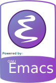

<h1 align="center" style="color: orange;">Monero Bahçesi 🌿🍄</h1>

<p align="center"> "Guru yok, metod yok, öğretmen yok. Sadece sen ve
ben, ve doğa, <b>bahçe</b> içinde." — Terence McKenna </p>

<p align="center"><a href="https://monerobahcesi.com"></a></p>

---

### Status

Text body translation is complete.  Next remaining steps:

- [ ] move the github pages to monerobahcesi.com URL
- [ ] create MoneroBahcesi.com stickers with URL's QR-code on them
- [ ] Add monero icons to the page template.  A site named "monero
      garden" doesn't have a single monero image in it.  Ridiculous.

### Run the garden locally

Clone the garden's repo and get into the cloned directory:

```bash
git clone https://github.com/monerogarden/web.git
cd web
```

On debian 12, open a terminal window and enter the following command
to install [nvm](https://github.com/nvm-sh/nvm):

```bash
curl -o- https://raw.githubusercontent.com/nvm-sh/nvm/v0.39.7/install.sh | bash
```

Close the terminal window, and open a new terminal window.  Change
directory back to the `web` directory.  Now using `nvm` install
compatible versions of nodejs and npm:

```bash
nvm install 18.14
```

Now enter the following command to compile the content:

```bash
npm i
npx quartz build --output docs --serve
```

The monero garden is now available locally.  Open a web browser and
visit `http://127.0.0.1:8080/` to view it.

---

<p align="center"><sub>Monero Bahçesi <a
href="https://quartz.jzhao.xyz/">quartz</a> ile
yaratılmıştır.</sub></p>


